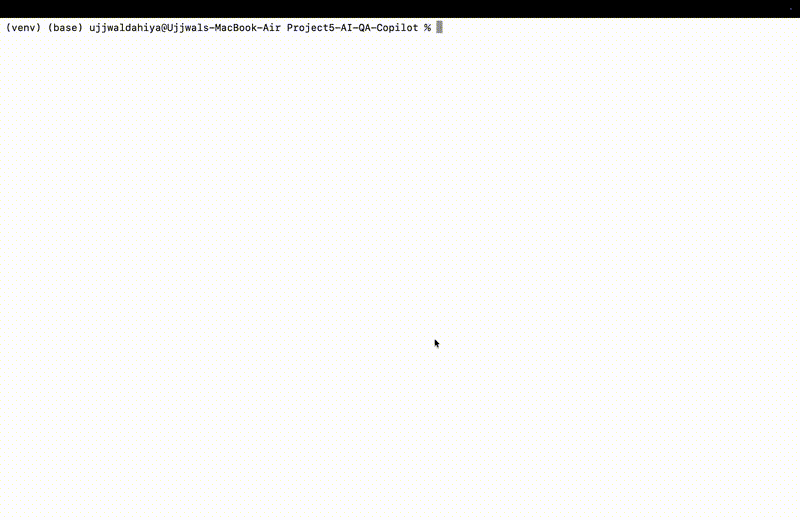

# AI QA Copilot

An end-to-end AI-powered QA automation tool that monitors GitHub Pull Requests,
reads the code changes, automatically generates targeted test cases, assesses
risk, and posts a full QA report directly as a comment on the PR — without any
human involvement.

## Demo



---

## The Problem It Solves

In most software teams, QA review of pull requests is entirely manual. A QA
engineer has to read the code diff, figure out what changed, write test cases
for those specific changes, assess the risk, and communicate findings back to
the developer. This takes hours and is often skipped under deadline pressure.

This tool automates the entire QA review pipeline — from reading the PR to
posting the report — in under 60 seconds.

---

## How It Works
```
Developer opens a Pull Request on GitHub
|
AI QA Copilot detects the open PR
|
Fetches the code diff from GitHub API
|
LLaMA 3.3 generates targeted test cases for the specific changes
|
LLaMA 3.3 performs a risk assessment of the changes
|
HTML report saved locally for visual review
|
Full QA report posted as a comment directly on the PR
```

---

## Live Demo

A demo PR is intentionally left open at:
https://github.com/ujjwaldahiya399/AI-QA-Copilot-Demo/pull/1

You can see the AI QA Copilot report posted automatically as a comment —
including generated test cases, risk assessment, and testing recommendations
based on the actual code changes in the PR.

---

## Sample Report Output

### Summary Cards
| Metric | Value |
|--------|-------|
| Files Changed | 1 |
| Lines Added | +10 |
| Lines Removed | -2 |
| Risk Level | MEDIUM |
| Quality Score | 6/10 |

### Risk Assessment
MEDIUM RISK — The PR introduces email validation to the login function.
Lack of PR description and potential edge cases in the validation function
raise concerns. Unit, Integration, and Security testing recommended.

### Generated Test Cases (AI generated from actual code diff)
- TC_001: Valid Login Credentials — Positive
- TC_002: Valid Login with Special Characters — Positive
- TC_003: Invalid Email Address — Negative
- TC_004: Empty Username — Negative
- TC_005: Password Length Edge Case — Edge Case
- TC_006: Email Injection Security Test — Security

---

## Tech Stack

- Python 3.14
- PyGithub (GitHub API integration)
- Groq API (free tier) + LLaMA 3.3 70B (AI analysis)
- HTML/CSS (visual report generation)

---

## Project Structure
```
Project5-AI-QA-Copilot/
├── copilot/
│   ├── __init__.py          <- makes copilot a Python package
│   ├── github_client.py     <- connects to GitHub, fetches PRs, posts comments
│   ├── analyzer.py          <- AI generates test cases and risk assessment
│   └── reporter.py          <- builds HTML report and PR comment
├── reports/
│   └── pr_1_report.html     <- local visual report per PR
├── config.py                <- all configuration and environment variables
├── main.py                  <- orchestrator that runs the full pipeline
└── requirements.txt
```

---

## Setup and Installation

### 1. Clone the repository
```bash
git clone https://github.com/ujjwaldahiya399/AI-QA-Copilot.git
cd AI-QA-Copilot
```

### 2. Create and activate virtual environment
```bash
python3 -m venv venv
source venv/bin/activate
```

### 3. Install dependencies
```bash
pip install -r requirements.txt
```

### 4. Set environment variables
```bash
export GROQ_API_KEY="your-groq-api-key"
export GITHUB_TOKEN="your-github-personal-access-token"
export GITHUB_REPO="username/your-repo-name"
```

### 5. Run the copilot
```bash
python3 main.py
```

The copilot will find all open PRs, analyze each one, post a report comment,
and open the HTML report in your browser automatically.

---

## Key Engineering Decisions

- **Modular architecture** — each component (GitHub client, analyzer, reporter)
  is a separate file with a single responsibility making it easy to extend
- **Diff trimming** — code diffs are trimmed to 8000 characters to stay within
  the model's token limit while preserving enough context for accurate analysis
- **Structured AI output** — response format is strictly enforced so every field
  is reliably parseable into the HTML report
- **Dual report format** — generates both an HTML report for local viewing and
  a markdown comment for GitHub so the report works everywhere
- **Environment variables** — all sensitive values loaded from environment
  variables so API keys never appear in source code

---

## Business Value

Reduces manual QA review time of pull requests from hours to under 60 seconds.
Ensures every PR gets test cases written for the specific changes made.
Catches security and edge case risks that manual reviewers often miss under
deadline pressure.
Gives developers immediate QA feedback without waiting for a QA engineer.

---

## Future Improvements

- [ ] GitHub Actions integration to run automatically on every PR opened
- [ ] Slack notification when high risk PRs are detected
- [ ] Support for multiple repositories monitored simultaneously
- [ ] Historical dashboard tracking PR quality scores over time
- [ ] Auto-generate pytest functions from the AI test cases

---

## Author

Ujjwal Dahiya
Masters Student | Aspiring SDET
GitHub: github.com/ujjwaldahiya399